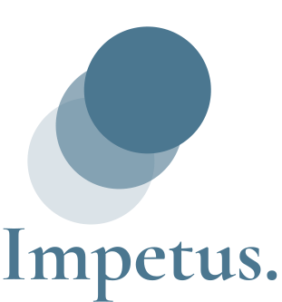

<p align="center">
  <a href="https://impetus.vercel.app" target="_blank">
    
  </a>
</p>

<div align="center">


</div>

<p align="center"> An elegant dashboard for your goals.
  <br>
</p>

---

## 📜 Table of Contents

- [About](#about)
- [Features](#features)
- [Getting Started](#getting_started)
- [License](#license)
- [Packages](#packages)
- [Docs](#docs)
- [Resources](#resources)

## 🧐 About <a name = "about"></a>

A
[Momentum](https://chrome.google.com/webstore/detail/momentum/laookkfknpbbblfpciffpaejjkokdgca)
clone made with Next.JS and Typescript.
Originally a
[vanilla Javascript project](https://github.com/librity/nc_nomentum)
with less features.

- Production App: https://impetus.vercel.app/
- [Figma](https://www.figma.com/file/V1hogXfkoiKoYbsaVyNJlC/Impetus?node-id=3%3A14)

I personally use this
and will be adding more useful features in the near future.
I'm committed to online privacy and anonymity, and this app will:

- Never save any personal data.
- Never use or save cookies.
- Never use any resources that push trackers (like google fonts).

<p align="center">
  <a href="https://impetus.vercel.app" target="_blank">
    
  </a>
</p>

## ✅ Features <a name = "features"></a>

- [x] NO TRACKING EVER!!!
  - [x] Serve Roboto font
  - [ ] Disable Vercel analytics (no vitals request)
- [x] Custom scrollbar
- [x] Source code link
- [x] Clock
  - [x] Basic clock
  - [ ] Custom timezone
- [x] Greeting
  - [x] Updates with time
- [x] Landscape background
  - [x] Random landscape from unsplash
  - [x] Change landscape every hour
- [x] Tasks
  - [x] Add task
  - [x] Save tasks to local storage
  - [x] Delete task
  - [ ] Edit tasks
  - [ ] Move task
  - [ ] Autofocus top task
- [x] Weather
  - [x] Current weather with icon
  - [ ] Weather forecast on hover
- [x] Search bar
  - [x] Search with DuckDuckGo
  - [ ] Select search site/engine
- [ ] Website Shortcuts
  - [ ] Add shortcut
  - [ ] Save shortcuts to local storage
  - [ ] Edit shortcut
  - [ ] Delete shortcut
- [ ] Crypto toolbar
  - [ ] Add coins of interest
  - [ ] Show price and change
  - [ ] Show price charts
  - [ ] Remove coins
- [ ] Manual session backups
  - [ ] Export local storage configs to file
  - [ ] Load local storage configs from file
- [ ] Timer
  - [ ] Rings when it's done
- [ ] Add/Remove features menu
- [ ] Soundscapes
- [ ] Pomodoro timer
- [ ] Notes
  - [ ] Add note
  - [ ] Save notes to local storage
  - [ ] Delete note
  - [ ] Edit notes
  - [ ] Move note

## 🏁 Getting Started <a name = "getting_started"></a>

### ⚙️ Prerequisites

- `node >= 16.13.0`

### 🖥️ Installation

1. Clone this repo locally and install the required packages:

```bash
$ git clone https://github.com/librity/impetus.git
$ cd impetus
$ npm install
```

2. Start a development server:

```bash
$ npm run dev
```

3. Open http://localhost:3000 with your web browser.

#### 🧼 Lint & Format

Format all source files with Prettier:

```bash
$ npm run format
```

Run ESLint:

```bash
$ npm run lint
```

## ⚖️ License <a name = "license"></a>

This project is [MIT licensed](LICENSE).

## 📦 Packages <a name = "packages"></a>

- https://github.com/Microsoft/TypeScript
- https://github.com/vercel/next.js/
- https://github.com/vercel/swr
- https://github.com/davidhu2000/react-spinners
- https://github.com/donavon/use-persisted-state
- https://github.com/garmeeh/next-seo
- https://github.com/twbs/icons

## 📚 Docs <a name = "docs"></a>

- https://swr.vercel.app/docs/data-fetching
- https://www.davidhu.io/react-spinners/
- https://react-icons.github.io/react-icons/

### Next.JS

- [Next.js Documentation](https://nextjs.org/docs)
- [Learn Next.js](https://nextjs.org/learn)
  - https://github.com/vercel/next-learn
- [Next.js deployment documentation](https://nextjs.org/docs/deployment)

## 🔗 Resources <a name = "resources"></a>

- https://fonts.google.com/specimen/Roboto
- https://github.com/alvarotrigo/fullpage.js
- https://github.com/serranoarevalo/momonton
- https://stackoverflow.com/questions/3191664/list-of-all-locales-and-their-short-codes

### Javascript

- https://stackoverflow.com/questions/18621612/find-and-remove-element-from-array
- https://www.delftstack.com/howto/javascript/javascript-float-to-int/
- https://stackoverflow.com/questions/2696692/setinterval-vs-settimeout
- https://stackoverflow.com/questions/55362152/how-to-open-a-new-tab-in-javascript
- https://developer.mozilla.org/en-US/docs/Web/JavaScript/Reference/Global_Objects/Date/toLocaleTimeString
- https://www.w3schools.com/js/js_string_search.asp

### ReactJS

- https://medium.com/programming-essentials/how-to-create-a-digital-clock-with-react-hooks-aa30f76cfe3f
- https://sebhastian.com/react-submit-form/
- https://react-typescript-cheatsheet.netlify.app/docs/basic/getting-started/forms_and_events/
- https://stackoverflow.com/questions/55370851/how-to-fix-binding-element-children-implicitly-has-an-any-type-ts7031
- https://reactjs.org/docs/hooks-reference.html#usestate
- https://www.kindacode.com/article/how-to-create-a-filter-search-list-in-react/

### Next.JS

- https://www.peterlunch.com/snippets/next-image-styling
- https://nextjs.org/docs/basic-features/image-optimization
- https://nextjs.org/docs/messages/next-image-unconfigured-host
- https://nextjs.org/docs/messages/react-hydration-error
- https://stackoverflow.com/questions/63212462/localstorage-in-static-nextjs-site-referenceerror-localstorage-is-not-defined
- https://stackoverflow.com/questions/57126760/nextjs-dynamic-title

### Quotes API

- https://github.com/lukePeavey/quotable
- https://api.quotable.io/random

### Backgrounds API

- https://awik.io/generate-random-images-unsplash-without-using-api/
- https://unsplash.com/developers

### Weather API

- https://openweathermap.org/current
- https://openweathermap.org/weather-conditions

### CSS

- https://flexboxfroggy.com/
- https://www.w3schools.com/cssref/func_linear-gradient.asp
- https://www.w3schools.com/cssref/pr_background-image.asp
- https://developer.mozilla.org/en-US/docs/Web/CSS/background-image
- https://stackoverflow.com/questions/6338217/get-a-css-value-with-javascript
- https://cssgradient.io/gradient-backgrounds/
- https://stackoverflow.com/questions/4847850/is-it-possible-to-define-constants-in-css
- https://stackoverflow.com/questions/5195303/set-css-property-in-javascript
- https://stackoverflow.com/questions/11757537/css-image-size-how-to-fill-but-not-stretch
- https://www.educba.com/css-text-outline/
- https://www.w3docs.com/snippets/css/how-to-set-space-between-flexbox-items.html
- https://www.w3schools.com/css/css_text_align.asp
- https://www.w3schools.com/CSSref/css3_pr_opacity.asp
- https://stackoverflow.com/questions/16989585/css-3-slide-in-from-left-transition
- https://www.w3schools.com/cssref/sel_focus.asp
- https://marksheet.io/css-priority.html
- https://www.w3schools.com/csS/css_overflow.asp
- https://developer.mozilla.org/en-US/docs/Web/CSS/@import
- https://www.w3schools.com/howto/howto_css_custom_scrollbar.asp
- https://www.w3schools.com/howto/howto_css_transition_hover.asp

### Meta Tags

- https://opengraph.dev/
- https://metatags.io/
- https://www.linkedin.com/post-inspector/inspect
- https://www.linkedin.com/pulse/how-clear-linkedin-link-preview-cache-ananda-kannan-p/
- https://stackoverflow.com/questions/10042786/how-to-successfully-implement-ogimage-for-the-linkedin
- https://kinsta.com/blog/linkedin-debugger/
- https://ahrefs.com/blog/open-graph-meta-tags/
- https://stackoverflow.com/questions/54266598/meta-tags-for-url-with-description-and-image-in-skype-discord

### Logo

- https://grahamhancock.com/kollerstromn2/
- https://fonts.google.com/specimen/Cormorant+Garamond

### Vercel Badge

- https://github.com/vercel/vercel/discussions/4824
- https://shields.io/category/other
- https://github.com/therealsujitk/vercel-badge
